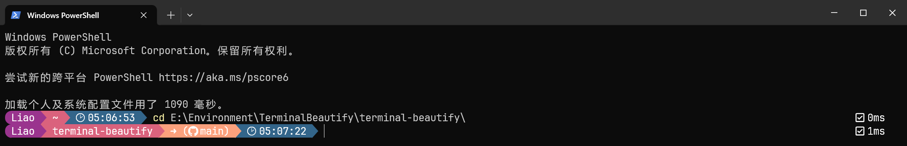

## 个人使用的一个终端美化器配置，基于[M365Princess](https://github.com/JanDeDobbeleer/oh-my-posh/blob/main/themes/M365Princess.omp.json)

### Windows 10环境使用前提：[terminal](https://github.com/microsoft/terminal) + [Oh My Posh](https://ohmyposh.dev/)

### 综合了官方的主题下，感觉不是很适合自己的感官...调整了一点点图标配置...

### 效果图：

### 开冲！！！